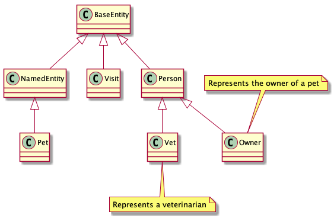

:source-highlighter: coderay
== Spring-Petclinic
In this document we want to show how to apply ideas from living documentation
by generating parts of the
https://speakerdeck.com/michaelisvy/spring-petclinic-sample-application[original presentation]
from the source code.

=== Petclinic core domain
ifdef::env-github[]

endif::[]

[plantuml,"data-access",png]
--
include::core-domain_class.puml[]
--

